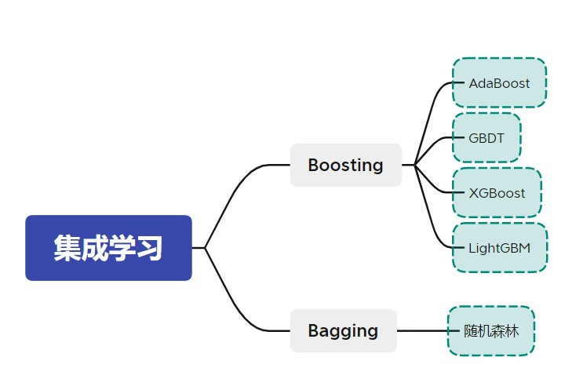

# 机器学习文本多分类

    源网址：https://blog.csdn.net/qq_41731978/article/details/109459234
    
中文文档分类数据集：

    陈旸老师的《人人都听得懂的清华大学数据挖掘》里的练习

数据说明：

    1、文档共有4中类型：女性、体育、文学、校园
    2、训练集放到train文件夹里，测试集放到test文件夹里。停用词放到stop文件夹里。

模型：

    KNeighborsClassifier
    DecisionTreeClassifier
    MLPClassifier
    BernoulliNB
    GaussianNB
    MultinomialNB
    LogisticRegression
    RandomForestClassifier
    AdaBoostClassifier
    xgboost.XGBClassifier
    lightgbm.LGBMClassifier
    SVC
    
输出：

    准确率、precision、recall、f1
    
集成学习方法：

    大致可以分为两大类，分别为Boosting和Bagging。

    Boosting：
        Boosting是将弱模型提升为强模型的算法，其工作机制为：先从初始训练集训练出一个弱模型，再根据此弱模型的表现对训练样本的分布进行调整，使得被此弱模型预测错了的样本得到更多的关注，然后利用调整过的样本来训练下一个弱模型，如此重复进行，直到弱模型的数目达到了事先指定的值或者指标达到预期，最后将这些弱模型进行加权求和便得到了强模型。
    
    Bagging：
        Bagging算法的工作机制为：通过自主采样法(bootstrap sampling)，即有放回的采样，对初始训练数据集进行采样，得到若干个样本子集，然后每个子集用来训练一个弱模型，最后再将这些弱模型结合为强模型。在分类任务中，Bagging算法通过简单投票法来输出样本的类别，即少数服从多数的原则；在回归任务中，则是通过对每个弱模型的输出进行平均来作为强模型的输出。
    
    对比：
        Boosting算法生成的弱模型有很强的依赖关系，且弱模型是串行生成的；
        Bagging算法生成的弱模型不存在强依赖关系且可以并行生成。
    
    常见的两类集成学习算法:
        Boosting：AdaBoost、GBDT、XGBoost和LightGBM等，
        Bagging：随机森林
        
如下图所示：

